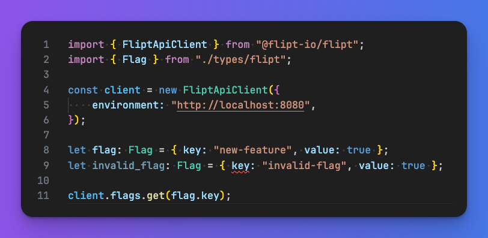

# Flipt Typed

[](https://www.npmjs.com/package/@flipt-io/typed)


<p align="center">
    
</p>

<p align="center">
    Generate static types from <a href="https://flipt.io">Flipt</a> features.
</p>

## Overview

Flipt Typed is a CLI tool that generates static types from Flipt [features.yml files](https://www.flipt.io/docs/configuration/storage#flag-state-configuration). It allows you to use Flipt feature flags in your code with type safety for flag keys, variants, and contexts.

It is currently experimental and under active development.

Language support is limited to **TypeScript** at the moment, however we plan to add support for other typed languages in the future.

Want support for your favorite language? [Let us know](https://github.com/flipt-io/typed/issues/new)!

## Why

Why would you want to use Flipt Typed? Here are a few reasons:

- Get IDE autocompletion and enable a safer and more streamlined development experience when using Flipt feature flags
- Avoid typos and other errors when integrating Flipt flag evaluation into your codebase
- Ensure that your code is always in sync with your Flipt features configuration
- Enable easier refactoring/cleanup of unused flags with Go To Definition and Find References

## Usage

1. Create Flags, Variants, Segments, etc in Flipt. See our [Getting Started](https://www.flipt.io/docs/introduction/getting-started) guide for more information.
1. Export your Flipt features to a `features.yml` file via `flipt export`. See our [export](https://www.flipt.io/docs/operations/import-export#export) documentation for more information.
1. Run `npx @flipt-io/typed` to generate static types from your `features.yml` file.

   Either copy and paste the output or pipe it to a file:

    ```console
    npx @flipt-io/typed --lang ts --input /path/to/features.yml

    npx @flipt-io/typed --lang ts --input /path/to/features.yml > /path/to/types.ts
    ```

1. Use the generated types in your code:

    ```typescript
    import { Flag } from "./types/flipt";

    let flag: Flag = { key: "new-feature", value: true };
    ```
